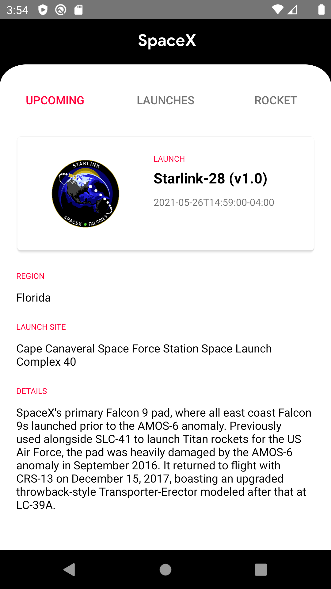
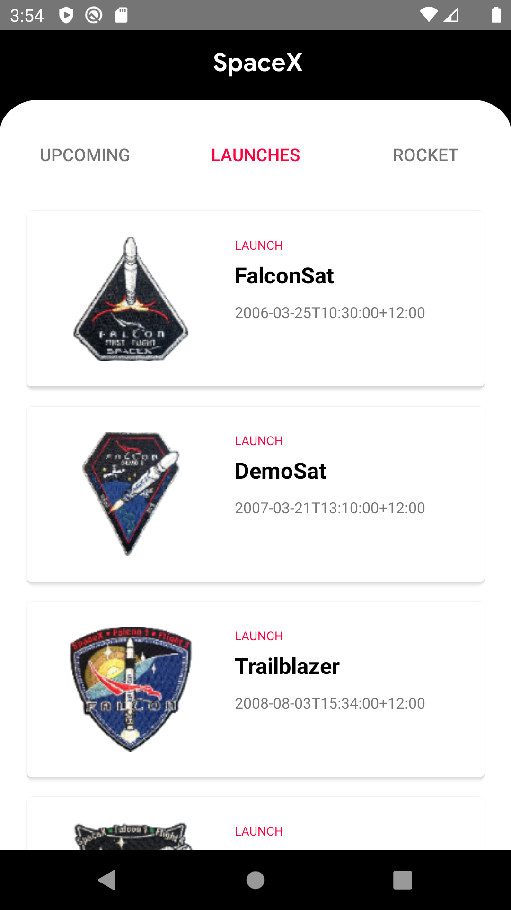
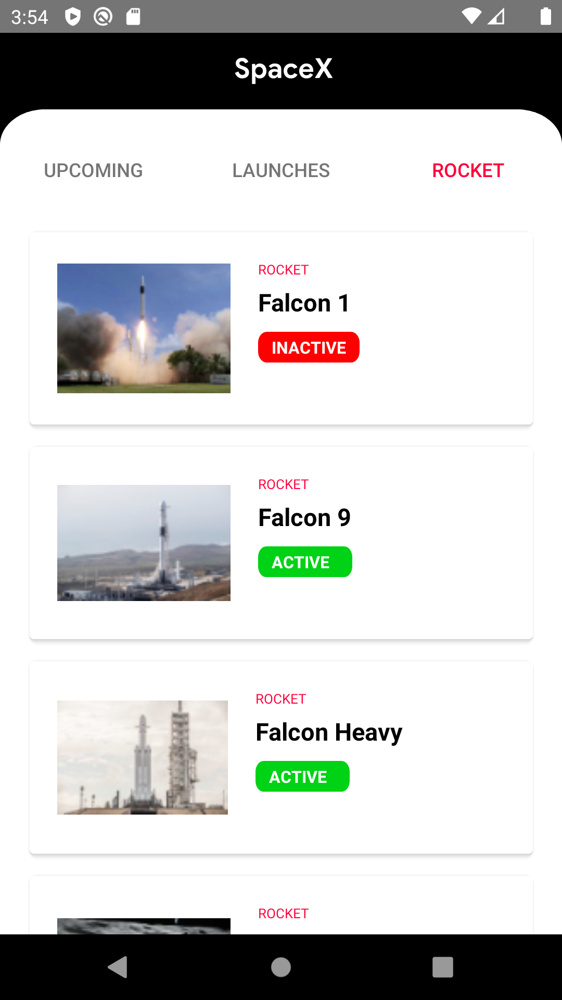

# GoSpaceX
Android application that showing data from https://api.spacexdata.com. This application made for learning purpose.

# Detail
- This application fully made with kotlin.
- Using MVVM
- Using ShimmerEffect
- Using RxJava
- Using Retrofit with RxJava2Call Adapter
- Using Glide for load image

# Screenshoot
 

